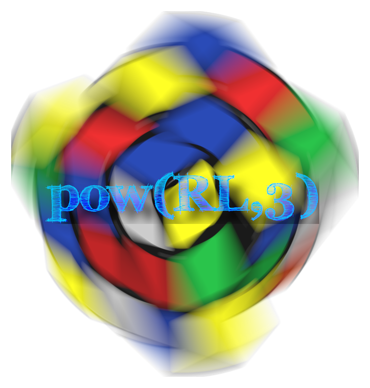

# powrl3

*Reinforcement Learning raised to the third power to solve a magic cube*

The aim of this project is to learn to use reinforcement learning models in a challenging task like this.
It is not pretended to build a killer model that solves all possible ways of the cube.

## Dependencies
Support for both Python 2.x and Python 3.x. Dependencies are listed in `requirements.txt`.

## Trained agents
> This part should have a table with trained models to download from the last release and try

## Examples
On the folder `examples/` you can find them in order to know how it can be used.

## Credits
- **Book:** Sutton, R. S., & Barto, A. G. (1998). *Reinforcement learning: An introduction.* MIT press.
- **Cube simulator:** https://github.com/adrianliaw/PyCuber
- **ChainerRL algorithms:** https://github.com/chainer/chainerrl
- **Logo font:** https://www.1001freefonts.com/fff-tusj.font
- **Logo cube image:** https://pixabay.com/es/cubo-de-rubik-cubo-rompecabezas-157058/

# TODO list:
- Complete testing
- Docker integration
- TravisCI deployment
- Handle multiple backends in a better way (e.g. ChainerRL, Tensorflow, MXNet, etc)

## License
[MIT License](LICENSE).
